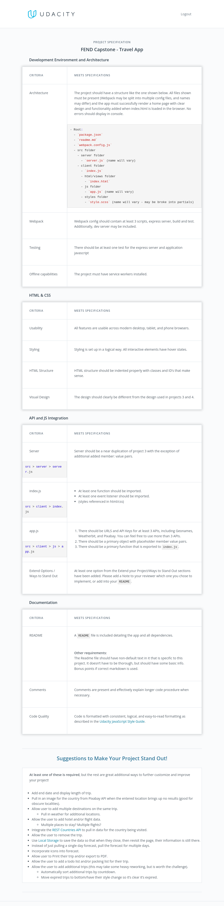
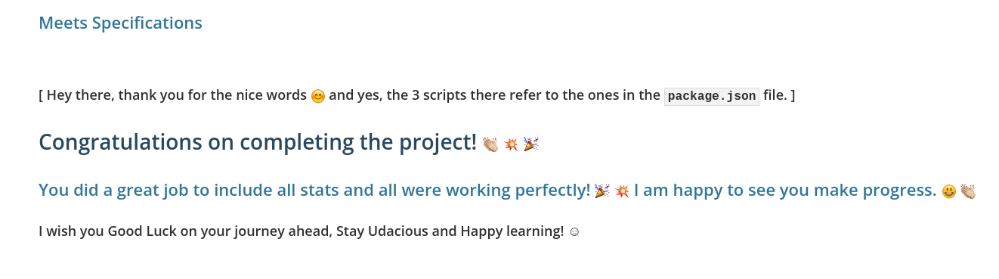

# FEND Capstone Project: Travel App

The last project submitted for the Udacity's Front End Developer nanodegree.

See the [Introduction](INTRODUCTION.md).

A travel scheduling app made in **vanilla Javascript** that:

- Obtains a desired trip location & a date from the user.
- Saves the data locally (in localStorage).
- And displays weather forecast and an image of the location using information
  obtained from three external APIs.

# Screenshots

### Autocomplete


### Desktop version


### Mobile version


---

## Rubric

This project has been evaluated by a Udacity code reviewer according to the
Evaluate a news article with Natural Language Processing project specifications below.

<details>
<summary>Project specification:</summary>

</details>

# Installation

_[NodeJs](https://nodejs.org/en/) must be installed on your local machine._

## Note

**IMPORTANT** **_The app uses three external APIs. For the app to work on your machine, you need the API keys:._**

- [geonames](http://www.geonames.org/export/web-services.html)
- [pixabay](https://pixabay.com/api/docs/)
- [weatherbit](https://www.weatherbit.io/account/create)

Rename the `.env.example` file to `.env` in the project directory, and replace
the values with your own API keys.

```
  //.env
GEONAME_KEY=<your_key>
PIXABAY_KEY=<your_key_string>
WEATHER_KEY=<your_key_string>
```

---

1. Open a terminal instance inside the project directory and run `npm install`.

2. run `npm run build:prod` to build the project.

3. run `npm start` in the terminal.

4. Open a navigator and visit `localhost:3000`.

For a brand new entry, use `localStorage.clear()` to clear all the trips from
your local storage.

# Stack

- Language: Javascript
- DB: LocalStorage
- Markdown: HTML
- Styling: css(scss)
- Bundler: Webpack(v5)
- Compiler: Babel
- Server: Express(node)
- HttpRequest: Fetch Api

# Testing

Both the [jest](https://jestjs.io) framework and the
[transform-runtime](https://www.npmjs.com/package/@babel/plugin-transform-runtime)
plugin are required to run the tests.

Testing the fetch functionality was done using [fetch-mock](https://www.npmjs.com/package/jest-fetch-mock)

Run `npm test` inside the project directory.

# Webpack

To run in development just run the npm script `build:dev`.

---

# Features

- An autocomplete menu that uses the geoname API to fuzzy search for a country.
- Storing trips information on the localStorage.
- The app runs offline leveraging the power of service workers

# Structure

```
    .
    ├── dist
    ├── src
    │   ├── client
    │   │   ├── img
    │   │   │   ├── pin.png
    │   │   ├── js
    │   │    │   ├── serviceWorkerRegistration.js
    │   │    │   ├── storage.js
    │   │   ├── styles
    │   │   │   ├── base.scss
    │   │   │   ├── form.scss
    │   │   │   ├── header.scss
    │   │   │   ├── nav.scss
    │   │   │   ├── reset.scss
    │   │   ├── views
    │   │   │   ├── page-index
    │   │   │   ├── styles
    │   │   │   │   ├── main.html
    │   │   │   │   ├── main.js
    │   │   │   │   ├── main.scss
    │   │   │   ├── page-trips
    │   │   │   │   ├── styles
    │   │   │   │   ├── js
    │   │   │   │   ├── main.html
    │   │   │   │   ├── main.js
    │   │   │   │   ├── main.scss
    │   ├── server
    │   │   ├── apiCalls.js
    │   │   ├── app.js
    │   │   ├── index.js
    │   ├── server
    ├── __test__
    ├── .env
    ├── .eslingt.js
    ├── webpack.common.js
    ├── webpack.dev.js
    ├── webpack.prod.js
    └── README.md
```

# Review

- [x] Project reviewed and passed successfully.
      
